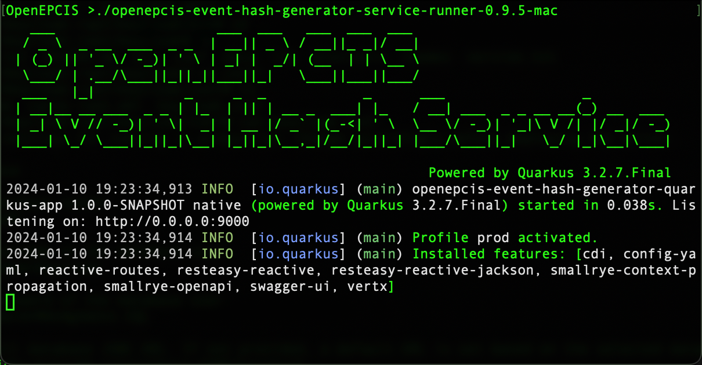

# OpenEPCIS Event Hash Generator

[](https://opensource.org/licenses/Apache-2.0)


A Java library for generating event hashes for EPCIS documents/events in XML/JSON-LD format. EPCIS, a GS1 standard recognized by ISO, IEC, and GS1, enhances cooperation between trading partners by exchanging data on products. The OpenEPCIS Event Hash Generator helps avoid duplicate event storage due to issues like hardware malfunctions or human error, ensuring data uniqueness and integrity.

## Table of Contents
1. [Features](#features)
2. [Running with Docker and Podman](#running-with-docker-and-podman)
    - [JVM Variant](#jvm-variant)
    - [Native Binary Variant](#native-binary-variant)
3. [Running Native Binaries](#running-native-binaries)
    - [Available Native Binaries](#available-native-binaries)
        - [CLI Instructions](#1-cli-instructions)
        - [REST Service Instructions](#2-rest-service-instructions)
4. [Usage Examples](#usage-examples)
    - [Generating Hash-Ids for XML Documents](#example-generating-hash-ids-for-xml-documents)
    - [Generating Hash-Ids for JSON/JSON-LD Documents](#example-generating-hash-ids-for-jsonjson-ld-documents)
    - [Using Subscription Logic with Reactive Streams](#example-using-subscription-logic-with-reactive-streams)
5. [Releases](#releases)
6. [Related Projects](#related-projects)
7. [References](#references)

## Features

- **Reactive Streams**: Offers efficient processing of millions of events through non-blocking back pressure.
- **Hash Algorithms**: Supports a wide range of algorithms including SHA, RSA, and MD5, catering to various security needs.
- **CBV Versions**: Ensures compatibility with both CBV 2.0 and 2.1 versions, enhancing flexibility.
- **Quarkus GraalVM Native Builds**: Dramatically reduces startup times and memory usage, ideal for cloud-native, microservices, and serverless architectures. Enables AOT compilation for creating lightweight, high-performance native executables.

## Running with Docker and Podman

### JVM Variant

Offers robust performance and portability across different platforms, harnessing the versatility of the Java Virtual Machine.

**Package URL:** [Event Hash Generator Service - JVM](https://github.com/openepcis/openepcis-event-hash-generator/pkgs/container/event-hash-generator-service)

#### Docker
```bash
docker pull ghcr.io/openepcis/event-hash-generator-service:latest
docker run --rm -p 9000:9000 --name event-hash-generator-jvm ghcr.io/openepcis/event-hash-generator-service:latest
```

#### Podman
```bash
podman pull ghcr.io/openepcis/event-hash-generator-service:latest
podman run --rm -p 9000:9000 --name event-hash-generator-jvm ghcr.io/openepcis/event-hash-generator-service:latest
```

### Native Binary Variant

Provides lightning-fast startup and reduced memory footprint, thanks to ahead-of-time compilation with GraalVM, perfect for high-performance and resource-constrained environments.

**Package URL:** [Event Hash Generator Service - Native](https://github.com/openepcis/openepcis-event-hash-generator/pkgs/container/event-hash-generator-service-native)

#### Docker
```bash
docker pull ghcr.io/openepcis/event-hash-generator-service-native:latest
docker run --rm -p 9000:9000 --name event-hash-generator-native ghcr.io/openepcis/event-hash-generator-service-native:latest
```

#### Podman
```bash
podman pull ghcr.io/openepcis/event-hash-generator-service-native:latest
podman run --rm -p 9000:9000 --name event-hash-generator-native ghcr.io/openepcis/event-hash-generator-service-native:latest
```

## Running Native Binaries

Native binaries are platform-specific compiled versions of software, optimized for enhanced performance on the designated operating system and architecture. The OpenEPCIS Event Hash Generator offers native binaries for various platforms, eliminating the need for a Java runtime environment.

Find the latest versions of these binaries at: [Latest Release](https://github.com/openepcis/openepcis-event-hash-generator/releases/latest).

### Available Native Binaries

1. **CLI (Command Line Interface)**: Ideal for batch processing. It provides a range of command-line options for customized operation.
2. **Service Runner**: Functions as a REST service on port 9000, with a Swagger UI accessible at `http://localhost:9000/q/swagger-ui/index.html`.

### 1. CLI Instructions

Replace `[platform]` and `[version]` with the appropriate platform (mac, windows, linux-amd64, linux-arm64) and version number:

```bash
# Usage example
./openepcis-event-hash-generator-cli-[version]-[platform]
```

CLI Options:

```bash
usage: OpenEPCIS Event Hash Generator Utility: [options] file.. url.., -
 -a,--algorithm <arg>        Hash Algorithm (e.g., sha-256).
 -b,--batch                  Output hashes to a .hashes file.
 -e,--enforce-format <arg>   Parse files as JSON or XML.
 -h,--help                   Show options.
 -j,--join <arg>             String to join the prehash string.
 -p,--prehash                Output the prehash string.
```

### 2. REST Service Instructions

Replace `[platform]` and `[version]` with the appropriate platform (mac, windows, linux-amd64, linux-arm64) and version number:

```bash
# Usage example
./openepcis-event-hash-generator-service-runner-[version]-[platform]
```


The Swagger UI will be accessible at `http://localhost:9000/q/swagger-ui/index.html`.

## Usage Examples

Below are examples demonstrating how to integrate the OpenEPCIS Event Hash Generator into your Java application. These snippets illustrate the basic setup and usage for both XML and JSON/JSON-LD documents.

### Example: Generating Hash-Ids for XML Documents

```java
// Initialize EventHashGenerator with the desired CBV version
EventHashGenerator eventHashGenerator = new EventHashGenerator(); // Defaults to CBV 2.0
EventHashGenerator eventHashGenerator2_1 = new EventHashGenerator(CBVVersion.VERSION_2_1_0); // For CBV 2.1

// Generate Hash-Ids from an XML document stream
InputStream xmlStream = getClass().getResourceAsStream("/XmlEpcisDocument.xml");
List<String> xmlHashIds = eventHashGenerator.fromXml(xmlStream, "sha-256").subscribe().asStream().toList();
```

### Example: Generating Hash-Ids for JSON/JSON-LD Documents

```java
// Initialize EventHashGenerator with the desired CBV version
EventHashGenerator eventHashGenerator = new EventHashGenerator(); // Defaults to CBV 2.0
EventHashGenerator eventHashGenerator2_1 = new EventHashGenerator(CBVVersion.VERSION_2_1_0); // For CBV 2.1

// Generate Hash-Ids from a JSON document stream
InputStream jsonStream = getClass().getResourceAsStream("/JsonEpcisDocument.json");
List<String> jsonHashIds = eventHashGenerator.fromJson(jsonStream, "sha-256").subscribe().asStream().toList();
```

### Example: Using Subscription Logic with Reactive Streams

This example shows how to utilize Reactive Streams for efficient and immediate processing of generated HashIds.

```java
// Use EventHashGenerator with Reactive Streams for on-the-fly processing of HashIds
EventHashGenerator eventHashGenerator = new EventHashGenerator();
Multi<Map<String, String>> xmlEventHash = eventHashGenerator.fromXml(xmlStream, "prehash", "sha-256");

// Subscribe to the stream to process each HashId as it's generated
xmlEventHash.subscribe().with(xmlHash -> System.out.println(xmlHash.get("sha-256") + "\n" + xmlHash.get("prehash") + "\n\n"), failure -> System.out.println("XML HashId Generation Failed with " + failure));
```

## Releases

Stay updated with the newest features and improvements by downloading the latest version of the OpenEPCIS Event Hash Generator:

**Download the Latest Release**: [Click Here](https://github.com/openepcis/openepcis-event-hash-generator/releases/latest)

## Related Projects

- **Core Library**: [openepcis-event-hash-generator](core)
- **Command-Line Utility**: [openepcis-event-hash-generator-cli](cli)
- **RESTful Service Bindings**: [openepcis-event-hash-generator-rest-api](rest-api)
- **Quarkus REST Application**: [openepcis-event-hash-generator-quarkus-app](quarkus-app)

## References

For detailed documentation on event hash generation and canonicalization, visit the [GitHub Repository](https://github.com/RalphTro/epcis-event-hash-generator).

