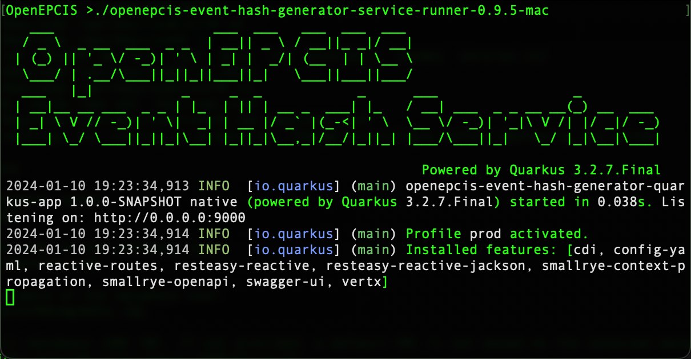

<p align="center">
  
</p>

[](LICENSE)
[](https://central.sonatype.com/artifact/io.openepcis/openepcis-event-hash-generator)
[](https://github.com/openepcis/openepcis-event-hash-generator/actions/workflows/maven-cli.yml)
[](https://github.com/openepcis/openepcis-event-hash-generator)

<h1 align="center">OpenEPCIS Event Hash Generator</h1>

Generates a stable hash id for every event in an [EPCIS](https://www.gs1.org/standards/epcis) document, so you can
tell if you have seen that event before. EPCIS is the GS1 standard for sharing supply chain event data between
trading partners, also published as ISO/IEC 19987.

Comes as a Java library, a command line tool, a REST service and ready to run native binaries.

## Why

The same event often arrives twice. A gateway retries, someone uploads a file again, or two systems report the
same movement. The event id does not help, because it is optional and every sender formats the document a little
differently.

This tool puts the event fields into the canonical order defined by the GS1 CBV standard, builds a pre-hash
string and hashes it. Two events with the same content give the same hash, even if one is XML and the other JSON.
Store the hash and duplicates are easy to find.

## Table of Contents

1. [Features](#features)
2. [Quick start](#quick-start)
3. [Use as a Java library](#use-as-a-java-library)
4. [REST API](#rest-api)
5. [Running with Docker and Podman](#running-with-docker-and-podman)
6. [Running native binaries](#running-native-binaries)
7. [Build from source](#build-from-source)
8. [Releases](#releases)
9. [Contributing](#contributing)
10. [Related](#related)
11. [References](#references)
12. [License](#license)

## Features

- **Reactive streams**: handles millions of events without loading the whole document into memory.
- **Hash algorithms**: `sha-1`, `sha-224`, `sha-256`, `sha-384`, `sha-512`, `sha3-224`, `sha3-256`, `sha3-384`,
  `sha3-512`, `md2` and `md5`. Default is `sha-256`.
- **Same hash for XML and JSON**: one event gives one hash id, whichever format it arrives in.
- **CBV 2.0 and CBV 2.1**: 2.0 stays the default, so hashes you already stored do not change.
- **Pre-hash output**: ask for `prehash` and you get the exact string that was hashed. Quickest way to see why
  two hashes differ.
- **GraalVM native builds**: start in milliseconds, use little memory, and need no Java runtime.

## Quick start

Run the service:

```bash
docker run --rm -p 9000:9000 \
  ghcr.io/openepcis/event-hash-generator-service:latest
```

Hash a document:

```bash
curl -X POST "http://localhost:9000/api/generate/event-hash/document" \
  -H "Content-Type: application/json" \
  -H "Accept: application/json" \
  --data-binary @my-epcis-document.json
```

You get one hash id per event:

```json
["ni:///sha-256;9b7d47...?ver=CBV2.0"]
```

Or try it in the browser at `http://localhost:9000/q/swagger-ui/index.html`.

## Use as a Java library

Add the dependency. The Maven Central badge above shows the newest version:

```xml
<dependency>
    <groupId>io.openepcis</groupId>
    <artifactId>openepcis-event-hash-generator</artifactId>
    <version>0.9.3</version>
</dependency>
```

`EventHashGenerator` is the entry point. `fromXml` and `fromJson` return a Mutiny `Multi`, so you can collect all
hashes into a list or take each one as it arrives.

### XML documents

```java
// Default constructor uses CBV 2.0
EventHashGenerator generator = new EventHashGenerator();

// Pass a version if you need CBV 2.1
EventHashGenerator generator21 = new EventHashGenerator(CBVVersion.VERSION_2_1_0);

try (InputStream xmlStream = getClass().getResourceAsStream("/XmlEpcisDocument.xml")) {
    List<String> hashIds = generator.fromXml(xmlStream, "sha-256")
            .subscribe().asStream().toList();
}
```

### JSON and JSON-LD documents

```java
EventHashGenerator generator = new EventHashGenerator();

try (InputStream jsonStream = getClass().getResourceAsStream("/JsonEpcisDocument.json")) {
    List<String> hashIds = generator.fromJson(jsonStream, "sha-256")
            .subscribe().asStream().toList();
}
```

### Take each hash as it is generated

Subscribe instead of collecting and nothing piles up in memory. Ask for `prehash` next to the algorithm and you
get both values for every event, which helps when two systems report a different hash for the same event.

```java
EventHashGenerator generator = new EventHashGenerator();

Multi<Map<String, String>> events = generator.fromXml(xmlStream, "prehash", "sha-256");

events.subscribe().with(
        event -> System.out.println(event.get("sha-256") + "\n" + event.get("prehash")),
        failure -> System.err.println("Hash generation failed: " + failure));
```

A long pre-hash string is easier to read with a separator between the fields, set by
`generator.prehashJoin("\n")`. This changes only what you see. The bytes that get hashed never contain newlines,
as the standard requires.

## REST API

The service listens on port 9000. Both endpoints take a `POST` with the document or event as the body, and read
the format from the `Content-Type` header (`application/json`, `application/xml` or `text/xml`).

| Endpoint                            | Body                               |
|-------------------------------------|------------------------------------|
| `/api/generate/event-hash/document` | A full EPCIS document              |
| `/api/generate/event-hash/events`   | A single event or a list of events |

Use `Accept: application/json` for a JSON array of hash ids, or `Accept: text/plain` for one hash per line.

| Query parameter   | Default   | What it does                                            |
|-------------------|-----------|---------------------------------------------------------|
| `hashAlgorithm`   | `sha-256` | Which algorithm to use, from the list under Features.   |
| `prehash`         | `false`   | Also return the pre-hash string that was hashed.        |
| `beautifyPreHash` | `false`   | Put each field of the pre-hash string on its own line.  |
| `cbvVersion`      | `2.0.0`   | CBV rules to apply, `2.0.0` or `2.1.0`.                 |

Example with CBV 2.1 and the pre-hash string included:

```bash
curl -X POST \
  "http://localhost:9000/api/generate/event-hash/document?cbvVersion=2.1.0&prehash=true" \
  -H "Content-Type: application/xml" \
  -H "Accept: application/json" \
  --data-binary @my-epcis-document.xml
```

## Running with Docker and Podman

### JVM variant

Runs on the Java Virtual Machine, so it behaves the same everywhere.

**Package:** [Event Hash Generator Service - JVM](https://github.com/openepcis/openepcis-event-hash-generator/pkgs/container/event-hash-generator-service)

```bash
docker pull ghcr.io/openepcis/event-hash-generator-service:latest
docker run --rm -p 9000:9000 \
  --name event-hash-generator-jvm \
  ghcr.io/openepcis/event-hash-generator-service:latest
```

### Native binary variant

Compiled ahead of time with GraalVM. Starts almost instantly and uses much less memory, which helps on small
containers and short lived jobs.

**Package:** [Event Hash Generator Service - Native](https://github.com/openepcis/openepcis-event-hash-generator/pkgs/container/event-hash-generator-service-native)

```bash
docker pull ghcr.io/openepcis/event-hash-generator-service-native:latest
docker run --rm -p 9000:9000 \
  --name event-hash-generator-native \
  ghcr.io/openepcis/event-hash-generator-service-native:latest
```

Podman takes the same commands, just replace `docker` with `podman`.

### Configuration

Two runtime properties are meant for operators. Each one accepts a JVM `-D` flag or an environment variable,
which Quarkus converts automatically:

| Property (JVM `-D`)                    | Environment variable                   | Default | Purpose                                                                                                                                                                                            |
|----------------------------------------|----------------------------------------|---------|----------------------------------------------------------------------------------------------------------------------------------------------------------------------------------------------------|
| `openepcis.event-hash.cbv-version`     | `OPENEPCIS_EVENT_HASH_CBV_VERSION`     | `2.0.0` | Default CBV version used when a request does not include a `cbvVersion` query parameter.                                                                                                           |
| `openepcis.eventhash.maxPendingEvents` | `OPENEPCIS_EVENTHASH_MAXPENDINGEVENTS` | `4096`  | Maximum number of pending events buffered between the SAX/JSON producer and a slow downstream consumer. Exceeding it fails the stream with `BackPressureFailure` rather than running out of memory. |

Example, CBV 2.1 as the default and a 16k event buffer:

```bash
docker run --rm -p 9000:9000 \
  -e OPENEPCIS_EVENT_HASH_CBV_VERSION=2.1.0 \
  -e OPENEPCIS_EVENTHASH_MAXPENDINGEVENTS=16384 \
  ghcr.io/openepcis/event-hash-generator-service:latest
```

See [`quarkus/quarkus-app/README.md`](quarkus/quarkus-app/README.md#configuration) for more detail.

### Observability

The service exposes the standard Quarkus management endpoints under `/q/`:

| Endpoint          | Format          | What it gives you                                                                      |
|-------------------|-----------------|----------------------------------------------------------------------------------------|
| `/q/metrics`      | Prometheus text | HTTP request rate/latency, JVM heap/GC/thread metrics. Scrape with Prometheus/Grafana. |
| `/q/health/ready` | JSON            | Readiness probe. Runs a smoke-test hash and reports `UP` only if the pipeline works.   |
| `/q/swagger-ui/`  | HTML            | Interactive API documentation.                                                         |

```bash
curl -s http://localhost:9000/q/metrics | head
curl -s http://localhost:9000/q/health/ready
```

## Running native binaries

Native binaries are compiled for one operating system and architecture, and they need no Java runtime installed.
Get them from the [latest release](https://github.com/openepcis/openepcis-event-hash-generator/releases/latest),
built for linux-amd64, linux-arm64, mac and windows.

### CLI

Good for batch work on files and URLs. Replace `[version]` and `[platform]` with what you downloaded:

```bash
./openepcis-event-hash-generator-cli-[version]-[platform] -a sha-256 epcis-document.xml
```

Options:

```
usage: OpenEPCIS Event Hash Generator Utility: [options] file.. url.., -
 -a,--algorithm <arg>        Hash algorithm: sha-1, sha-224, sha-256, sha-384,
                             sha-512, sha3-224, sha3-256, sha3-384, sha3-512,
                             md2, md5. Default sha-256.
 -b,--batch                  Write the hashes into a sibling .hashes file
                             instead of stdout.
 -e,--enforce-format <arg>   Parse all given files as json or xml. By default
                             the format is guessed from the file ending.
 -h,--help                   Show all available options.
 -j,--join <arg>             String used to join the pre-hash string. Values
                             like "\n" are useful for debugging.
 -p,--prehash                Also print the pre-hash string. Writes a
                             .prehashes file when combined with -b.
```

The shaded jar works the same way:

```bash
java -jar openepcis-event-hash-generator-cli-[version]-jar-with-dependencies.jar \
  -a sha-256 epcis-document.xml
```

### Service runner

The REST service on port 9000, with the Swagger UI at `http://localhost:9000/q/swagger-ui/index.html`:

```bash
./openepcis-event-hash-generator-service-runner-[version]-[platform]
```



## Build from source

You need JDK 25 and Maven. CI uses GraalVM Community Edition 25, and the native builds need GraalVM.

```bash
export JAVA_HOME=$(/usr/libexec/java_home -v 25)
mvn -Pci-build clean package
```

The `ci-build` profile turns off the code formatter plugin, which is usually what you want locally.

The parent POM `io.openepcis:openepcis-bom` lives in
[its own repository](https://github.com/openepcis/openepcis-bom) and is downloaded from Sonatype snapshots. If
the build stops while resolving `openepcis-bom`, that is why.

```bash
# Test the core library only
mvn -pl core test

# Run the service in dev mode with hot reload on port 9000
mvn -f quarkus/quarkus-app/pom.xml quarkus:dev

# Native CLI binary, needs GraalVM
mvn -Pci-build -Pnative clean package -DskipTests -f cli/pom.xml
```

## Releases

Jars, container images and native binaries are published for every `v*` tag. See the
[latest release](https://github.com/openepcis/openepcis-event-hash-generator/releases/latest).

## Contributing

Issues and pull requests are welcome. A hash that looks wrong is worth an issue on its own, and the most useful
report has the EPCIS document, the CBV version you used and the pre-hash string from `--prehash`, because that
shows which field caused the difference.

## Related

- [openepcis-event-hash-generator](core) - the core Java library
- [openepcis-event-hash-generator-cli](cli) - the command line tool
- [openepcis-event-hash-generator-rest-api](rest-api) - the JAX-RS endpoints
- [openepcis-event-hash-generator-quarkus-app](quarkus/quarkus-app) - the runnable service
- [Event Hash Generator Web App](https://tools-dev.openepcis.io/ui/event-hash-generator) - a web-based interface for generating EPCIS event hashes
- [OpenEPCIS Tools](https://tools.openepcis.io/) - open source EPCIS 2.0 tools and services
- [OpenEPCIS](https://openepcis.io/) - read more about OpenEPCIS
- [benelog GmbH & Co. KG](https://www.benelog.com/) - the company behind OpenEPCIS
- [GS1 EPCIS Standard](https://www.gs1.org/standards/epcis) - learn more about EPCIS

## References

- [GS1 EPCIS and CBV standard](https://www.gs1.org/standards/epcis) - defines the canonical form and the
  hashing rules.
- [epcis-event-hash-generator](https://github.com/RalphTro/epcis-event-hash-generator) - the reference Python
  implementation by Ralph Tröger, used to cross-check results.

## License

Licensed under the [Apache License 2.0](LICENSE).
